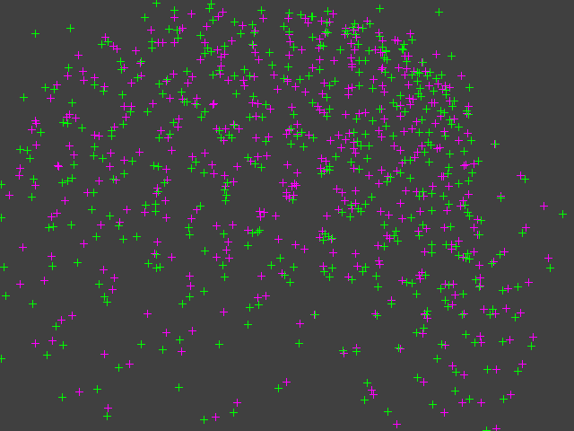

# Camera Calibration using Zhang's Method

A simple Python library for calibrating camera intrinsics from sensor (2D) and model point (3D) correspondences.
Written with few external dependencies (numpy, sympy, imageio) for a more manual implementation and a deeper understanding.
Non-linear optimization is done through minimizing projection error and computing partial derivatives with [`sympy`](https://docs.sympy.org/latest/index.html) to populate the Jacobian matrix.
Generates synthetic datasets for testing and rudimentary visualization.
Can animate of the reprojection error each iteration of the calibration.
Dockerized for convenience of development, testing, and maybe deployment.
Supports radial-tangential `(k1, k2, p1, p2, k3)` and fisheye `(k1, k2, k3, k4)` distortion models.

Does not include any feature detection for sensor points. Takes sets of points as inputs, not images.

Prerequisites: `make`, `docker`

## Getting started

If you'd like to try out the code:

- Clone the repo and `cd` into it
- (Modify code if desired)
- `$ make test`

## Animated reprojection

This is an example of the reprojection animation of a calibration on a checkerboard, showing all views simultaneously (see [animate.py](./src/animate.py)).
- Green: the measured points
- Magenta: the reprojection of the model points

## Maybe later:

- [ ] Button up as python package, add instructions to README

## References:
- (paper) [Wilhelm Burger: Zhang's Camera Calibration Algorithm: In-Depth Tutorial and Implementation](https://www.researchgate.net/publication/303233579_Zhang's_Camera_Calibration_Algorithm_In-Depth_Tutorial_and_Implementation).
- (paper) [Zhengyou Zhang: A Flexible New Technique for Camera Calibration](https://www.microsoft.com/en-us/research/wp-content/uploads/2016/02/tr98-71.pdf)
- (video) [Cyrill Stachniss: Direct Linear Transform](https://www.youtube.com/watch?v=3NcQbZu6xt8&ab_channel=CyrillStachniss)
- (video) [Cyrill Stachniss: Camera Calibration using Zhang's Method](https://www.youtube.com/watch?v=-9He7Nu3u8s&ab_channel=CyrillStachniss)
